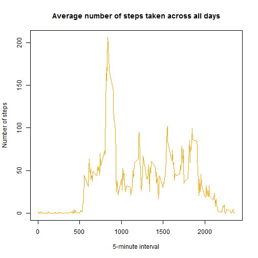
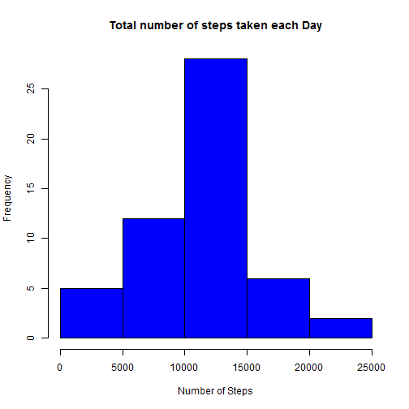
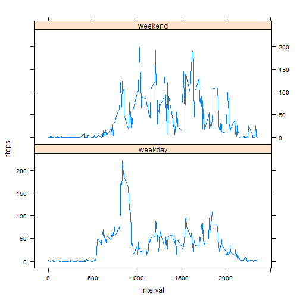

```r
---
title: "RepData Peer Assesment 1"
output: html_document
---

## Loading and proccessing the data
```

```
## Error: <text>:7:0: unexpected end of input
## 5: 
## 6: ## Loading and proccessing the data
##   ^
```

```r
setwd("C:/Users/Kari/Documents/R/Activity monitoring data")

file <- "repdata%2Fdata%2Factivity.zip"
if (!file.exists(file)){
  fileURL <- "https://d396qusza40orc.cloudfront.net/repdata%2Fdata%2Factivity.zip"
  download.file(fileURL, file, mode = "wb")
}  
if (!file.exists("Activity monitoring data")) { 
  unzip(file) 
}


activity <- read.csv("activity.csv")

meanact <- aggregate(steps ~ date, activity, mean)
```

# What is mean total number of steps taken per day?
We calculate the total number of steps taken per day, ignoring the missing values in the dataset. 
We make a histogram with this information.


```r
sumact <- aggregate(steps ~ date, activity, sum)
hist(sumact$steps,col="red", main="Total number of steps taken each Day", xlab="Number of Steps")
```



```r
meanssteps <- round(mean(sumact$steps))
mediansteps <- round(median(sumact$steps))
print(c("The mean is", meanssteps))
```

```
## [1] "The mean is" "10766"
```

```r
print(c("The median is ", mediansteps))
```

```
## [1] "The median is " "10765"
```
* The mean number of the total number of steps taken per day is 10766 and the median is 10765.


# What is the average daily activity pattern?
 
We plot the 5-minute interval and the average number of steps taken, averaged across all days.

```r
intervalsteps <- aggregate(steps ~ interval, activity, mean, na.rm = TRUE)
plot(intervalsteps, type = "l", col = "orange", xlab = "5-minute interval", ylab = 
       "Number of steps", main = "Average number of steps taken across all days")
```


```r
maxinterval <- intervalsteps$interval[which.max(intervalsteps$steps)]
print(c("The interval that contains the maximum number of steps is", maxinterval))
```

```
## [1] "The interval that contains the maximum number of steps is"
## [2] "835"
```
The 5-minute interval, on average across all the days in the dataset, which contains the maximum number of steps is interval number 835.

## Imputing missing values

There are a number of days/intervals where there are missing values (coded as NA). The presence of missing days may introduce bias into some calculations or summaries of the data.
We calculate the total number of missing values in the dataset.


```r
activityna <- sum(is.na(activity$steps))
datesna <- sum(is.na(activity$date))
intervalsna <- sum(is.na(activity$interval))
totalna <- activityna+datesna+intervalsna

print(c("The number of missing values in the dates column is", datesna))
```

```
## [1] "The number of missing values in the dates column is"
## [2] "0"
```

```r
print(c("The number of missing values in the intervals column is ", intervalsna))
```

```
## [1] "The number of missing values in the intervals column is "
## [2] "0"
```

```r
print(c("The number of missing values in the steps column is ", activityna))
```

```
## [1] "The number of missing values in the steps column is "
## [2] "2304"
```

```r
print(c("The total number of missing values in the dataset is ", totalna))
```

```
## [1] "The total number of missing values in the dataset is "
## [2] "2304"
```
Note that the only missing values of the dataset are found in the steps column. We will now fill in for all the missing values in this column. We will do that by replacing each missing value with the daily mean. We create a new dataset that is equal to the original dataset but with the missing data filled in.


```r
newdata <- activity
for (i in nrow(newdata)) {
  if (is.na(activity$steps[i])==TRUE){
    newdata$steps[i] <- (meanact$date[i])
  }
  
}
```

We will make a histogram of the total number of steps taken each day.

```r
newdatasteps <- aggregate(steps ~ date, newdata, sum)
hist(newdatasteps$steps, col = "blue", main="Total number of steps taken each Day", xlab="Number of Steps")
```



Let us now analyize the impact of imputing missing data.

```r
meansnewdata <- round(mean(newdatasteps$steps))
mediannewdata <- round(median(newdatasteps$steps))
print(c("The mean of the total number of steps taken per day is", meansnewdata, "The median is "
        , mediannewdata))
```

```
## [1] "The mean of the total number of steps taken per day is"
## [2] "10766"                                                 
## [3] "The median is "                                        
## [4] "10765"
```

```r
print(c("The difference between the two means is", meanssteps-meansnewdata))
```

```
## [1] "The difference between the two means is"
## [2] "0"
```

```r
print(c("The difference between the two medians is", mediansteps-mediannewdata))
```

```
## [1] "The difference between the two medians is"
## [2] "0"
```
The values found with these calculations differ from the first part of this report. The mean and the median values coincide after the missing data have been filled in, while before these values were diferent. 

## Differences in activity patterns between weekdays and weekends

Using the filled in dataset, we create a new factor variable with two levels - "weekday" and "weekend" indicating whether a given date is a weekday or weekend day.


```r
daytype <- function(data){
  if (weekdays(as.Date(data)) %in% c("sabado", "domingo")){
    "weekend"
  } else {"weekday"}
}
newdata$daytype <- as.factor(sapply(newdata$date, daytype))
```


We make a panel plot of the 5-minute interval and the average number of steps taken, averaged across all weekday days or weekend days.

```r
intervalsteps2 <- aggregate(steps ~ interval + daytype, newdata, mean)
library(lattice)
xyplot(steps~interval|factor(daytype),data = intervalsteps2,layout= c(1,2),type="l")
```


```

